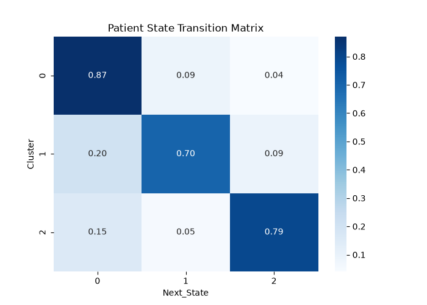
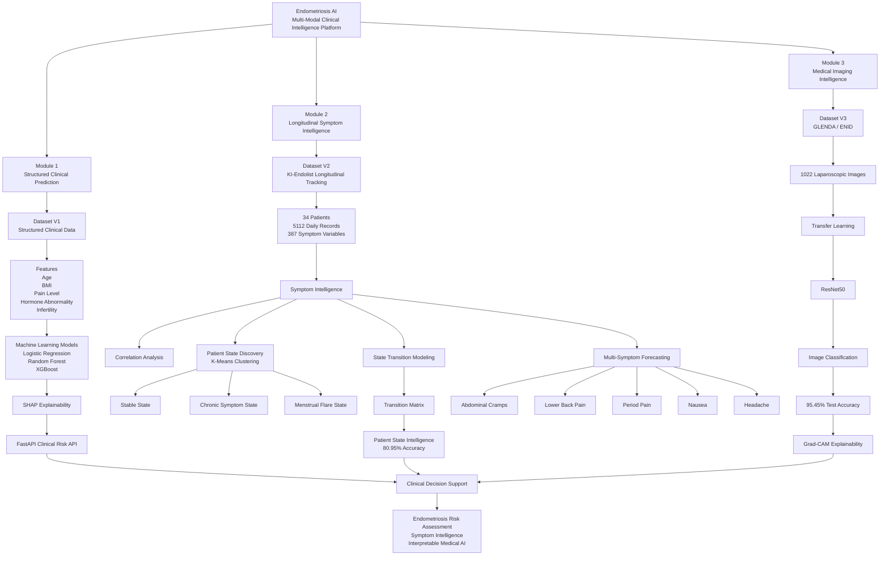
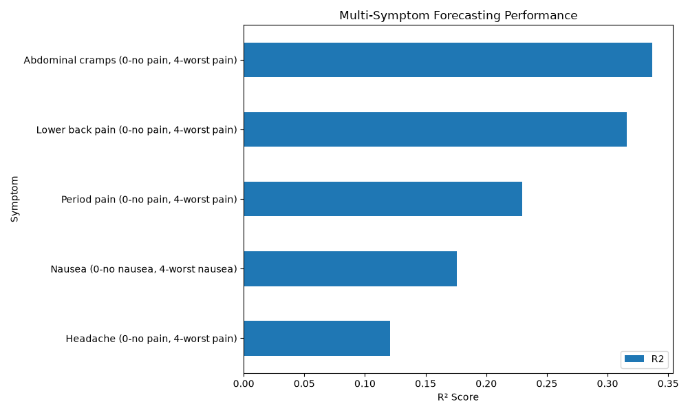
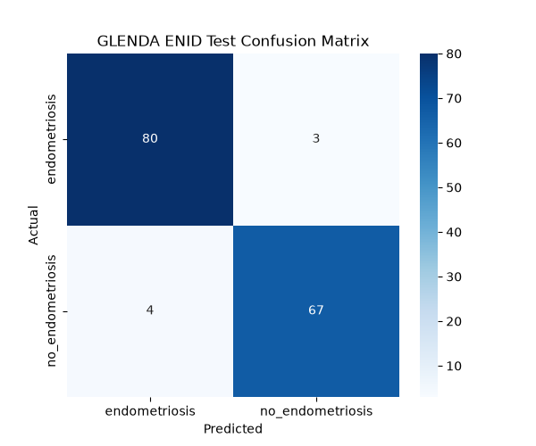
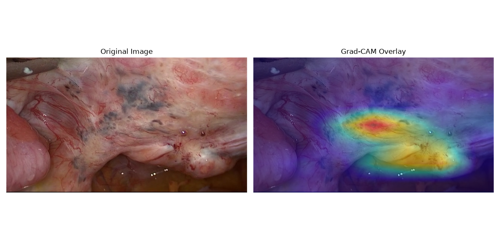

# Endometriosis AI: Multi-Modal Clinical Intelligence Platform

A multi-modal healthcare AI platform for endometriosis prediction, symptom intelligence, patient-state modeling, and medical imaging analysis.

---

## Project Overview

Endometriosis affects approximately 10% of women of reproductive age and often experiences diagnostic delays of 7–10 years.

This project explores how Artificial Intelligence can support earlier identification and understanding of endometriosis through three complementary data modalities:






```
```

## Key Results

| Module | Result |
|----------|----------|
| Structured Prediction | ROC-AUC 0.657 |
| Patient State Intelligence | 80.95% Accuracy |
| Medical Imaging Intelligence | 95.45% Accuracy |
| Explainability | SHAP + Grad-CAM |

### Module 1 — Structured Clinical Prediction

Predict endometriosis risk from demographic and clinical variables.

### Module 2 — Longitudinal Symptom Intelligence

Discover patient states, forecast symptom severity, and model disease progression using daily symptom tracking data.

### Module 3 — Medical Imaging Intelligence

Detect endometriosis from laparoscopic surgical images using deep learning and explainable AI.

---

# System Architecture

```text
Dataset V1 (Structured Clinical Data)
            ↓
     Risk Prediction

Dataset V2 (Longitudinal Tracking)
            ↓
 Symptom Intelligence
 State Discovery
 State Prediction

Dataset V3 (Medical Images)
            ↓
 Image Classification
 Explainable AI (Grad-CAM)
```

---

# Module 1 — Structured Risk Prediction

## Dataset

Features:

* Age
* BMI
* Menstrual Irregularity
* Chronic Pain Level
* Hormone Level Abnormality
* Infertility

Target:

* Endometriosis Diagnosis

## Models Evaluated

| Model               | Accuracy | ROC-AUC |
| ------------------- | -------: | ------: |
| Logistic Regression |    0.635 |   0.657 |
| Random Forest       |    0.598 |   0.610 |
| XGBoost             |    0.631 |   0.644 |

## Key Finding

Model performance was limited primarily by dataset quality and feature richness rather than algorithm complexity.

## Explainability

SHAP analysis identified:

* Hormone Level Abnormality
* BMI
* Chronic Pain Level
* Infertility
* Menstrual Irregularity

as the strongest predictors.

---

# Module 2 — Symptom Intelligence

## Dataset

KI-Endolist Longitudinal Dataset

* 34 Patients
* 5112 Daily Observations
* 387 Symptom Variables

## Correlation Analysis

Key relationships discovered:

* Period ↔ Bleeding: 0.81
* Emotional ↔ Physical Condition: 0.62
* Bleeding ↔ Physical Condition: -0.28

## Patient State Discovery

K-Means clustering identified three clinically meaningful symptom states:


### Stable State

* Good physical condition
* Good emotional condition
* Minimal symptoms

### Chronic Symptom State

* Persistent symptom burden
* Reduced wellbeing
* Low menstrual activity

### Menstrual Flare State

* Active menstruation
* Increased bleeding
* Reduced physical condition

## State Transition Analysis

State persistence probabilities:

| State                 | Persistence |
| --------------------- | ----------: |
| Stable State          |       87.0% |
| Chronic Symptom State |       70.4% |
| Menstrual Flare State |       79.4% |

## Symptom Forecasting

| Symptom          |    R² |
| ---------------- | ----: |
| Abdominal Cramps | 0.337 |
| Lower Back Pain  | 0.316 |
| Period Pain      | 0.230 |
| Nausea           | 0.176 |
| Headache         | 0.121 |



## Patient State Intelligence

Random Forest classification achieved:

* Accuracy: 80.95%
* Stable State Recall: 87%
* Menstrual Flare Recall: 83%
* Chronic Symptom Recall: 60%

Key insight:

Patient states were significantly more predictable than individual symptoms.

---

# Module 3 — Medical Imaging Intelligence

## Dataset

GLENDA / ENID Laparoscopic Imaging Dataset

| Class            | Images |
| ---------------- | -----: |
| Endometriosis    |    533 |
| No Endometriosis |    489 |

Total Images: 1022

Resolution: 640 × 360 RGB

## Confusion Matrix



## Model

* ResNet50 Transfer Learning
* PyTorch

## Training Results

Best Validation Accuracy:

99.35%

## Test Results

| Metric    |  Value |
| --------- | -----: |
| Accuracy  | 95.45% |
| Precision |    95% |
| Recall    |    95% |
| F1 Score  |    95% |

Confusion Matrix:

| Actual           | Predicted Endometriosis | Predicted No Endometriosis |
| ---------------- | ----------------------: | -------------------------: |
| Endometriosis    |                      80 |                          3 |
| No Endometriosis |                       4 |                         67 |

## Explainable AI

Grad-CAM visualizations demonstrated that the model focused on localized pelvic tissue regions rather than irrelevant image areas.

This improves interpretability and trust in model predictions.

## Explainable AI



Grad-CAM visualizations demonstrated that the model focused on localized pelvic tissue regions rather than irrelevant image areas.

---

# API Deployment

The structured prediction model is deployed using:

* FastAPI
* Swagger UI
* Joblib Model Serialization

Example Request:

```json
{
  "Age": 32,
  "Menstrual_Irregularity": 1,
  "Chronic_Pain_Level": 8,
  "Hormone_Level_Abnormality": 1,
  "Infertility": 0,
  "BMI": 24
}
```

Example Response:

```json
{
  "risk_probability": 0.72,
  "prediction": "High Risk"
}
```

---

# Tech Stack

## Data Science

* Python
* Pandas
* NumPy
* Matplotlib

## Machine Learning

* Scikit-Learn
* XGBoost
* SHAP

## Deep Learning

* PyTorch
* TorchVision
* ResNet50

## Deployment

* FastAPI
* Swagger
* Joblib

## Development

* Jupyter Notebook
* Git
* GitHub

---

# Project Structure

```text
endometriosis-ai/
│
├── data/
├── docs/
├── figures/
├── models/
├── notebooks/
├── src/
├── requirements.txt
└── README.md
```

---

# Disclaimer

This project is intended for educational and research purposes only and is not a medical device or diagnostic tool.
